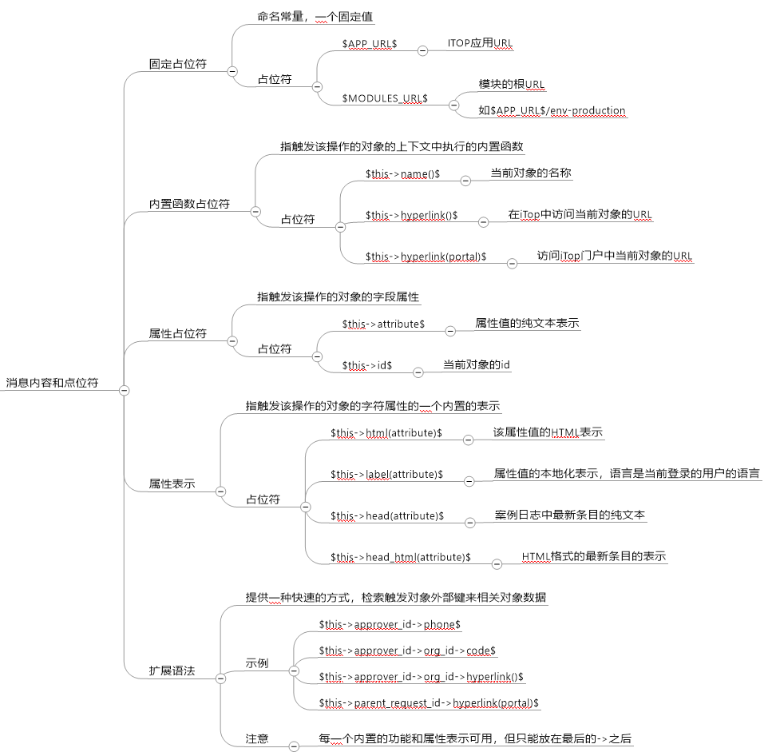

## itop FAQ 常见问题列表

### 1、官方Wiki（不需要翻墙）

https://wiki.openitop.org/
里面有详细的文档介绍

比如，调用api进行二次开发

    https://wiki.openitop.org/doku.php?id=2_3_0:advancedtopics:rest_json&s[]=api

个性定制itop

    https://wiki.openitop.org/doku.php?id=2_3_0:customization:start

扩展插件下载
  
    https://wiki.openitop.org/doku.php?id=extensions:start

[itop虚拟化docker容器部署](https://github.com/vbkunin/itop-docker)

[更多...](https://wiki.openitop.org)

### 2、个性定制itop中文

笔者自己翻译的版本，现在放到这个文档中

[个性定制itop中文](个性化定制.md)

### 3、itop中文论坛和qq群

ITIL和itop实施中文论坛 http://www.itilxf.com/

qq群 233051696

### 4、itop在线中文文档 

    http://itop.doc.hardie.me/

### 5、itop 邮件配置

/conf/production/config-itop.php 改为（默认为只读，修改为可写，操作完后改只读，210版本后可以直接后台配置）
 
查找email_transport  修改'email_transport' => 'PHPMail'为（注意qq邮箱需要去qq web邮箱管理授权SMTP访问，授权时候会设置一个密码
一下配置的密码为授权smtp访问时候设置的面）： 

	  'email_transport' => 'SMTP',
	  'email_transport_smtp.host' => 'smtp.qq.com',
	  'email_transport_smtp.password' => 'sbmht',
	  'email_transport_smtp.username' => '1000@qq.com',
      'forgot_password_from' => '1000@qq.com',

鉴于SMTP传输文件是明码传输，容易被人监听内容，不安全。同时某些运营商如果阿里云是禁止`25`端口，用普通SMTP协议根本发送不了邮件
我推荐使用ssl/tls证书加密的邮件，加密协议配置如下：

        'email_transport' => 'SMTP',
        'email_transport_smtp.encryption'=> 'tls',
        'email_transport_smtp.port ' => 465,
        'email_transport_smtp.host' => 'smtp.qq.com',
        'email_transport_smtp.password' => 'sbmht',
        'email_transport_smtp.username' => '1000@qq.com',
        'forgot_password_from' => '1000@qq.com',

>注意启用该功能需要`php_openssl`模块，通过`php.ini`开启该模块，如果没有的话，需要先安装该模块。

### 6、导入导出数据乱码

修改配置文件（ /conf/production/config-itop.php），或者通过后台`管理工具-配置`修改

     'csv_file_default_charset' => 'ISO-8859-1',

修改为

    'csv_file_default_charset' => 'UTF-8',

然后整个过程保证文件编码都是utf8.

### 7、时间不对，差7个小时

itop默认为巴黎时间，和北京时间插7个小时，修改配置文件（/conf/production/config-itop.php），
或者通过后台`管理工具-配置`修改

    'timezone' => 'Europe/Paris',

修改为
 
    'timezone' => 'Asia/Shanghai',

###  8、触发器模版(以创建用户账号为例)

来自 `itop@xxx.com`     

回复到     

收件人 `SELECT Person WHERE id= :this->contactid`

抄送 `SELECT Person JOIN lnkPersonToTeam AS T ON T.person_id = Person.id WHERE T.team_id = :this->manager_group_id`

隐送    

主题 `你的iTop 账户信息`     

邮件体 

     <pre>$this->first_name$ $this->last_name$你好</pre> 

     <pre>你的iTop账户被创建</pre> 
     <pre>iTop 登录地址：</pre> 
     <pre>http://ip/pages/UI.php</pre> 

     <pre>你的用户名为：$this->login$</pre> 

     <pre>用户密码为:xxx</pre> 

     <pre>请登录后更改密码！本邮件为系统自动邮件，请勿回复，任何问题与建议请联系xxx</pre> 

     <pre>xxx公司iTop</pre> 

上面邮件内容中的关键字变量，请参考下图(群友北京－悟(271986501)原创)

### 9、最新版本汉化

ITIL先锋论坛和群已经提供了2.5的中文版，可以下载使用

最新版本2.6还没有汉化包，官方汉化文件还是老早之前的，严重不全，可以用[2.5版本汉化文件压缩包](zh-cn.dict.php.zip)
解压覆盖新安装的新版本（各个版本都适用）的文件，即可。需要覆盖的文件是（注意备份）：

    env-production\dictionaries\zh-cn.dict.php

注意新版本有文件缓存，替换文件后，需要清理缓存，方法是清空`data/cache-production`即可。

### 10、profile 角色用户描述翻译

直接修改表 priv_urp_profiles

清空`priv_urp_profiles`现有表数据

    TRUNCATE `itop_priv_urp_profiles`; 

执行以下SQL生成汉化的数据：

    INSERT INTO `itop_priv_urp_profiles` (`id`, `name`, `description`) VALUES
     (1, 'Administrator', '可以不受限制操作任何对象'),
     (2, 'Portal user', '配置该角色的账号，不能访问除门户之外的其他功能，所有的访问将被重新定向到门户界面'),
     (3, 'Configuration Manager', '负责对已受控制配置项进行文档化管理'),
     (4, 'Service Desk Agent', '负责创建事件报告'),
     (5, 'Support Agent', '负责分析和解决问题'),
     (6, 'Problem Manager', '分析和解决当前问题的人'),
     (7, 'Change Implementor', '负责执行变更'),
     (8, 'Change Supervisor', '负责监控变更的整个生命周期'),
     (9, 'Change Approver', '负责审批变更'),
     (10, 'Service Manager', '负责服务交付给客户(内部)'),
     (11, 'Document author', '负责文档编写'),
     (12, 'Portal power user', '在授予其他角色的基础上，可以通过门户来访问所有的事件单');

### 11、用LNMP一键安装包安装itop 2.3.4时候安装不上的问题

经过排查发现主要是安装程序在获取系统路径时候使用_SERVER[“SERVER_NAME”]函数，而该函数获取的是当时
系统web服务器（nginx）的server_name 值（默认设置为_），导致安装程序的相关js文件不能正常加载，所以安装
程序不能获取相关配置的参数，导致安装不成功。解决方法：

1）、修改相关获取路径的php文件（方法需要懂php，在此忽略）。

2）、修改nginx配置文件，/usr/local/nginx/conf/nginx.conf的server_name值：

    server_name _; 修改为 server_name IP;

IP为你服务器所在ip地址。然后重加载nginx配置即可
  
     /usr/local/nginx/sbin/nginx -s reload

### 12、本地可以打开，但是其他机器打不开，或者能打开，但是样式和图片加载不出来。

  主要是`app_root_url`参数设置有问题。

      将 'app_root_url' => 'http://localhost/itop/', 
      或者  'app_root_url' => 'http://127.0.0.1/itop/', 

  修改为

      'app_root_url' => '/itop/',

  清理掉页面缓存，具体方法为：

  清空/data/cache-production目录

### 13、邮件自动生成工单：

  注意安装插件时候不同版本对应的版本不同（不兼容）：

  itop 2.02以前版本对应的 [ticket-from-email 2.2](https://wiki.openitop.org/doku.php?id=extensions:ticket-from-email_2_2)
                                                  
  itop 2.02以后到itop2.2 版本对应的 [ticket-from-email 2.6.12](https://wiki.openitop.org/doku.php?id=extensions:ticket-from-email_2_6)
 
  itop 2.3以后版本用[ticket-from-email 3.0.5](https://wiki.openitop.org/doku.php?id=extensions:ticket-from-email)
    
  其中安装过程，插件包中3.0版本中两个文件夹对应安装连个插件，安装后在管理工具有个收件箱功能菜单，
通过他可以在后台配置邮箱等相关数据，很方便，建议使用。而之前版本只对应安装一个插件，没有配置菜单，
只能通过配置文件手动配置。

### 14、`graphviz`和生成图的问题

  `graphviz` do not found(executable path: /usr/bin/dot)。

  itop的CI可以根据配置的依赖和影响关系自动生成拓扑图。但是图形生成要依赖`graphviz`软件来生成，`graphviz`如果系统没有的话需要安装。
支持linux和windows的安装，linux下安装可以用包管理软件，比如Centos可以用`yum install graphviz`，安装后为默认的/usr/bin/dot下。如果是
window下和linux编译安装的话，就在其他目录，这时候就需要配置dot所在路劲。这可以在系统安装中配置，或者安装好后再配置文件设置，比如：

    'graphviz_path' => 'C:\\Program Files\\Graphviz\\bin\\dot.exe',

### 15、itop安卓客户端

有个开源安卓客户端，不过很久已经没有更新了，可以[下载](https://github.com/michael71/ItopEnterprise)尝试。

### 16、汉化版时间控件不能点选的问题

表现使用汉化版时间空间时候点不出时间选择页面，经排查是时间控件汉化时候编码冲突。解决办法：

修改`application`目录下`itopwebpage.class.inc`和`portalwebpage.class.inc`文件:

搜索`if ($sJSLangShort != '"en"')`改为`if ($sJSLangShort == 'NULL')`

itop QQ群（233051696）雨博扬给出解决方法。

### 其他问题，持续增加中...

## 本仓库地址

本仓库托管于[Github](https://github.com/bollwarm/itop_FAQ)和[Gitee](https://gitee.com/ijz/itop_FAQ)，信息完善需要大家的参与，欢迎大家提供PR，一起完善。

国内用户如果github访问缓慢，或者没法访问时候可以访问[Gitee](https://gitee.com/ijz/itop_FAQ)。

